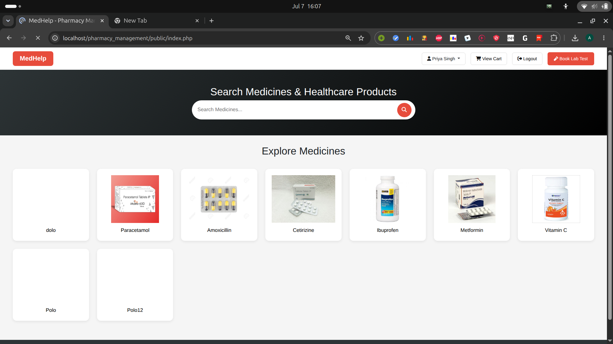
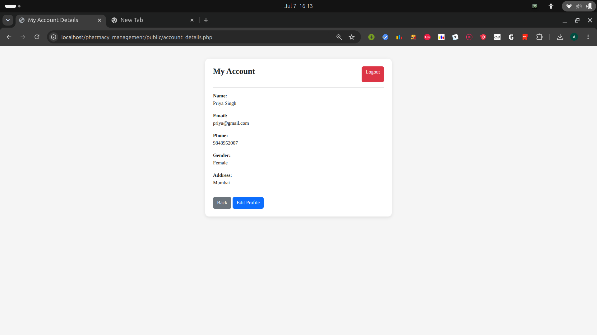
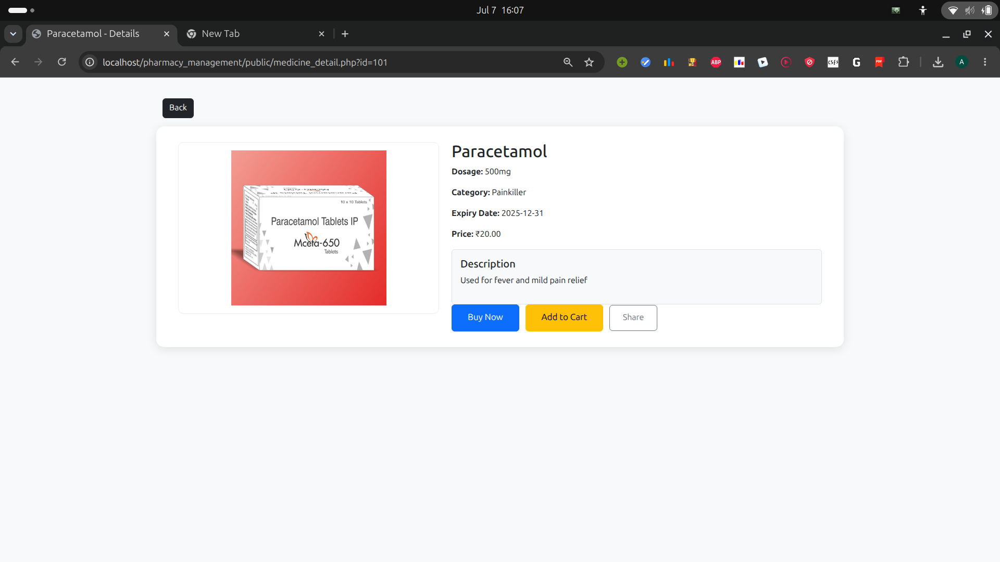
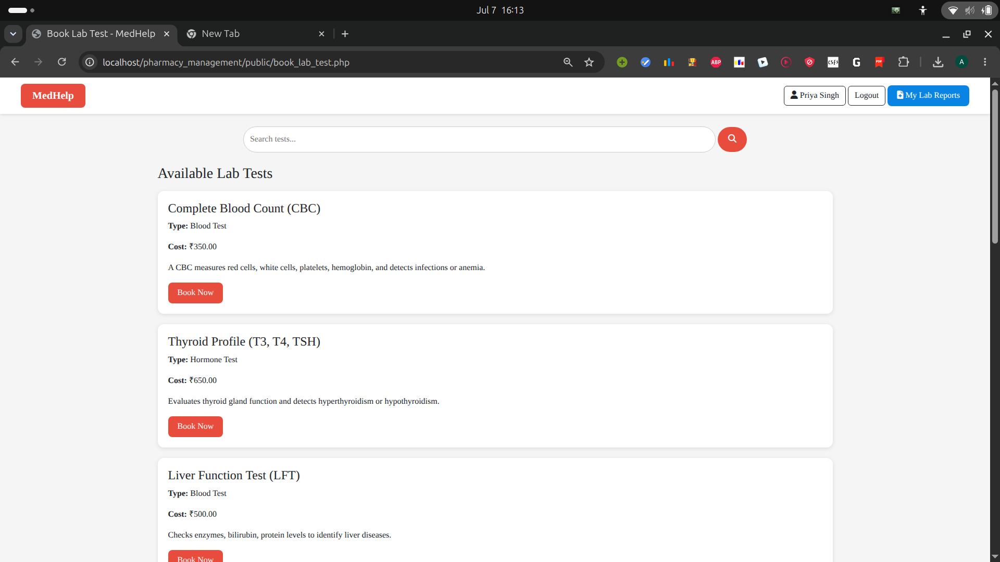
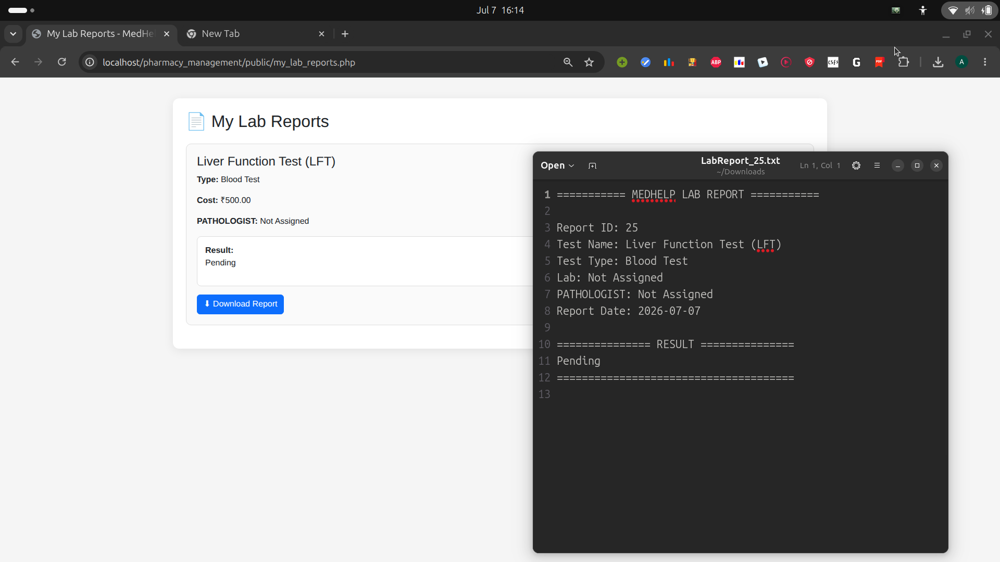
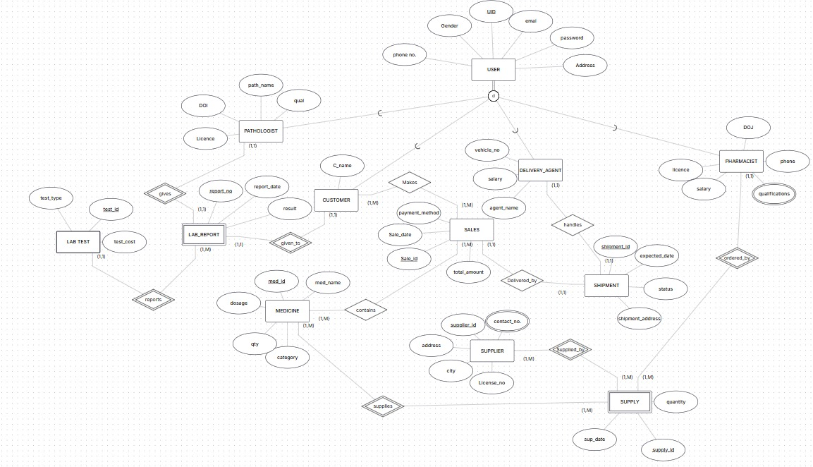

# Pharmacy Management System

A comprehensive, multi-role pharmacy management system built with PHP and MySQL that facilitates medicine sales, lab test bookings, and order management with integrated delivery tracking.

## Overview

**MedHelp** is a multi-role pharmacy management platform with support for Customers, Admins, Pharmacists, Pathologists, and Delivery Agents. Features include medicine sales, lab test bookings, order management, and delivery tracking with role-based access control.

---

## 🎯 Key Features

### 👥 Multi-Role System

1. **Customers**
   - Browse and search medicines
   - Add medicines to cart and purchase
   - Book diagnostic lab tests
   - Track order status in real-time
   - View lab test reports (download as PDF)
   - Manage account and profile details

2. **Administrators**
   - Manage staff (add pharmacists, pathologists, delivery agents)
   - Manage suppliers
   - View all orders and order history
   - Monitor lab tests by customer
   - Track total earnings
   - View staff details and performance

3. **Pharmacists**
   - Manage medicine inventory
   - Process customer orders
   - View all orders
   - Assign pathologists to lab tests
   - Track delivery assignments
   - Handle pending lab reports

4. **Pathologists**
   - Assign lab tests
   - Update and submit test results
   - Track test assignments

5. **Delivery Agents**
   - View assigned deliveries
   - Update delivery status
   - Mark orders as delivered
   - Track delivery history

### 📋 Main Functionalities

- **Medicine Management**: Browse, search, view details, manage inventory
- **Shopping Cart**: Add/remove medicines, place orders
- **Lab Testing**: Book tests, assign pathologists, upload results, download reports
- **Order Tracking**: Real-time order status updates for customers
- **Delivery Management**: Assign and track deliveries
- **Account Management**: Profile editing, account details, authentication
- **Search & Filter**: Search medicines by name, filter by categories
- **Report Generation**: Download lab test reports as PDF

---

## 📁 Project Structure

```
pharmacy_management/public/
├── general/                    # General authentication & public pages
│   ├── index.php              # Homepage with medicine listing
│   ├── login.php              # User login
│   ├── register.php           # Customer registration
│   ├── dashboard.php          # Role-based dashboard router
│   ├── account_details.php    # User account details
│   ├── edit_profile.php       # Profile editing
│   └── logout.php             # Logout functionality
│
├── customer/                   # Customer module
│   ├── customer_dashboard.php # Customer home
│   ├── buy_medicine.php       # Medicine shopping
│   ├── medicine_detail.php    # Medicine details
│   ├── cart.php               # Shopping cart
│   ├── add_to_cart.php        # Add to cart handler
│   ├── order_medicines.php    # Medicine checkout
│   ├── order_success.php      # Order confirmation
│   ├── my_orders.php          # Order history
│   ├── customer_order_tracking.php # Track orders
│   ├── book_lab_test.php      # Book lab tests
│   ├── confirm_lab_test.php   # Confirm test booking
│   ├── test_detail.php        # Lab test details
│   ├── test_success.php       # Test booking confirmation
│   ├── my_lab_reports.php     # View lab reports
│   └── download_report.php    # Download PDF reports
│
├── admin/                      # Administrator module
│   ├── admin_dashboard.php    # Admin home
│   ├── admin_add_pharmacist.php    # Add new pharmacist
│   ├── admin_add_pathologist.php   # Add new pathologist
│   ├── admin_add_delivery_agent.php # Add delivery agent
│   ├── admin_add_supplier.php  # Manage suppliers
│   ├── admin_view_staff.php    # View all staff
│   ├── admin_all_orders.php    # View all orders
│   ├── admin_lab_tests.php     # View all lab tests
│   ├── admin_lab_tests_by_customer.php # Lab tests by customer
│   └── admin_total_earnings.php # Financial reports
│
├── pharmacist/                 # Pharmacist module
│   ├── pharmacist_dashboard.php     # Pharmacist home
│   ├── pharmacist_all_medicines.php # Manage inventory
│   ├── pharmacist_all_orders.php    # View orders
│   ├── pharmacist_delivery_assignments.php # Manage deliveries
│   ├── pharmacist_pending_reports.php # Pending lab reports
│   ├── pharmacist_previous_assignments.php # Assignment history
│   └── pharmacist_previous_pathologist_assignments.py # Report history
│
├── pathologist/                # Pathologist module
│   ├── pathologist_dashboard.php # Pathologist home
│   ├── assign_pathologist.php  # Assign tests
│   └── update_result.php       # Update test results
│
├── delivery/                   # Delivery Agent module
│   ├── delivery_dashboard.php      # Delivery home
│   ├── assign_delivery.php         # View assignments
│   ├── update_delivery_status.php  # Update order status
│   └── delivered_orders.php        # Delivery history
│
├── images/                     # Image assets folder
├── database_design.jpeg        # Database schema diagram
└── README.md                   # This file
```

---

## 🗄️ Database Schema

**Primary Tables:**

- **USERS**: User profiles (UID, name, email, password, role, status)
- **CUSTOMER**: Customer extension (CID, C_name)
- **MEDICINE**: Inventory (Med_ID, med_name, price, quantity_in_stock, expiry_date)
- **ORDERS**: Customer orders (Order_ID, CID, order_date, total_amount, status)
- **LAB_TESTS**: Diagnostic tests (TEST_ID, test_name, price)
- **TEST_BOOKINGS**: Test orders (TEST_BOOKING_ID, CID, pathologist_id, status)
- **DELIVERY**: Delivery tracking (Delivery_ID, Order_ID, delivery_agent_id, status)
- **PHARMACIST, PATHOLOGIST, DELIVERY_AGENT, SUPPLIER**: Supporting tables

See `database_design.jpeg` for complete schema.

---

## 🚀 Installation & Setup

**Prerequisites**: XAMPP, PHP 7.4+, MySQL 5.7+

1. Copy project to `C:\xampp\htdocs\pharmacy_management\`
2. Create database `pharmacy_management` in PhpMyAdmin
3. Import database schema from `database_design.jpeg`
4. Update credentials in `config/db.php`
5. Start Apache & MySQL in XAMPP
6. Access: `http://localhost/pharmacy_management/public/general/index.php`

---

## 📝 User Workflows

**Customer**: Register → Login → Browse & buy medicines → Add to cart → Checkout → Track orders → Book lab tests → Download reports

**Admin**: Login → Manage staff & suppliers → Monitor orders → Track lab tests → View earnings

**Pharmacist**: Login → Manage inventory → Process orders → Assign pathologists → Track deliveries

---

## 🔐 Security Features

- **Session-Based Authentication**: PHP session management
- **Role-Based Access Control (RBAC)**: Access restricted by user role
- **Status Management**: Inactive accounts blocked
- **Session Validation**: All pages validate `$_SESSION['uid']` and `$_SESSION['role']`

**Recommendations**: Use password hashing, prepared statements to prevent SQL injection, input sanitization, and HTTPS in production.

---

## 🎨 User Interface & Tech Stack

**UI**: Bootstrap 5.3.0, Font Awesome 6.4.0, responsive mobile-friendly design

**Stack**: PHP 7.4+, MySQL 5.7+, HTML5, CSS3, Apache (XAMPP), PHP Sessions

---

## 📋 Key PHP Files

**General**: `login.php`, `register.php`, `logout.php`  
**Customer**: `buy_medicine.php`, `order_medicines.php`, `book_lab_test.php`, `my_orders.php`  
**Admin**: `admin_dashboard.php`, `admin_add_pharmacist.php`, `admin_all_orders.php`  
**Pharmacist**: `pharmacist_all_medicines.php`, `pharmacist_all_orders.php`  
**Pathologist**: `update_result.php`  
**Delivery**: `update_delivery_status.php`

---

## 🚀 Running the Application

1. Start XAMPP (Apache & MySQL)
2. Access: `http://localhost/pharmacy_management/public/general/index.php`
3. Login with customer, admin, or pharmacist accounts

---

## 👨‍💻 Development Notes

**Add New Role**: Create role folder, dashboard PHP with session check, update login redirect  
**Add New Feature**: Create PHP file in module folder, add session validation, implement database logic

## 📸 Screenshots

### 🏠 Home Page


### 👤 Account Page


### 💊 Medicines


### 🧪 Lab Test Booking


### 📄 Lab Report


### 🗄️ Database Design (ER Diagram)

